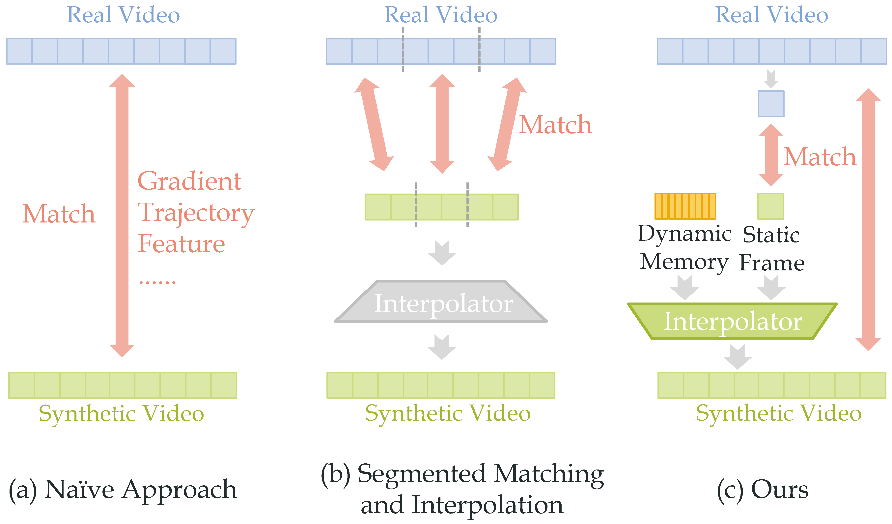

This is official implementation of [Dancing with Still Images: Video Distillation via Static-Dynamic Disentanglement](https://arxiv.org/abs/2312.00362) in CVPR 2024.   
**[Ziyu Wang](https://github.com/yuz1wan) \*, [Yue Xu](https://silicx.github.io) \*, [Cewu Lu](https://www.mvig.org) and [Yong-Lu Li](https://dirtyharrylyl.github.io)**   
<sup> * Equal contribution </sup> <br>
## Overview

In this work, we provide the first systematic study of video distillation and introduce a taxonomy to categorize temporal compression. It first distills the videos into still images as static memory and then compensates the dynamic and motion information with a learnable dynamic memory block.

If there are any questions, please contact me(wangxiaoyi2021@sjtu.edu.cn). 

## Usage
Our method is a plug-and-play module.
1. Clone our repo.
```
git clone git@github.com:yuz1wan/video_distillation.git
cd video_distillation
```
2. Prepare video datasets.  
For convenience, we use the video dataset in the form of frames. For UCF101 and HMDB51, we use the RGB frames provided in [twostreamfusion](https://github.com/feichtenhofer/twostreamfusion) repository and then resize them. For Kinetics-400 and Something-Something V2, we extract frames using the code in [extract_frames/](./extract_frames/). You can adjust the parameters to extract frames of different sizes and quantities.

```
distill_utils
├── data
│   ├── HMDB51
│   │   ├── hmdb51_splits.csv
│   │   └── jpegs_112
│   ├── Kinetics
│   │   ├── broken_videos.txt
│   │   ├── replacement
│   │   ├── short_videos.txt
│   │   ├── test
│   │   ├── test.csv
│   │   ├── train
│   │   ├── train.csv
│   │   ├── val
│   │   └── validate.csv
│   ├── SSv2
│   │   ├── frame
│   │   ├── annot_train.json
│   │   ├── annot_val.json
│   │   └── class_list.json
│   └── UCF101
│       ├── jpegs_112
│       │       ├── v_ApplyEyeMakeup_g01_c01
│       │       ├── v_ApplyEyeMakeup_g01_c02
│       │       ├── v_ApplyEyeMakeup_g01_c03
│       │       └── ...
│       ├── UCF101actions.pkl
│       ├── ucf101_splits1.csv
│       └── ucf50_splits1.csv
└── ...

```
3. Baseline.
For full-dataset training, you can use the dataloaders in distill_utils/dataset.py and **evaluate_synset** function(with mode = 'none') in utils.py.  

For coreset selection strategy, we refer to [k-center baseline](https://github.com/VICO-UoE/DatasetCondensation/issues/21) for k-center strategy and [herding baseline](https://github.com/VICO-UoE/DatasetCondensation/issues/15) for herding strategy. Our implementation is in distill_coreset.py.
1. Static Learning.  
We use [DC](https://arxiv.org/abs/2006.05929v3) for static learning. You can find DC code in this [repo](https://github.com/VICO-UoE/DatasetCondensation) and we provide code to load single frame data at utils.py. singleUCF50, singleHMDB51, singleKinetics400, singleSSv2 are for static learning. You can use them just like MNIST in DC. 
Or you can use [static memory](https://drive.google.com/drive/folders/1v6VlW0Ohmu5rDgamTqDeQFiMMIZpKl3v?usp=sharing) trained by us.
1. Dynamic Fine-tuning.  
We have thoroughly documented the parameters employed in our experiments in [Suppl](https://arxiv.org/abs/2312.00362).
For DM/DM+Ours
```
cd sh/baseline
# bash DM.sh GPU_num Dateset Learning_rate IPC
bash DM.sh 0 miniUCF101 30 1


# for DM+Ours
cd ../s2d
# for ipc=1
bash s2d_DM_ms.sh 0,1,2,3 miniUCF101 1e-4 1e-5

# for ipc=5
bash s2d_DM_ms_5.sh 0,1,2,3 miniUCF101 1e3 1e-6
```

For MTT/MTT+Ours, it is necessary to first train the expert trajectory with buffer.py (refer [MTT](https://github.com/georgecazenavette/mtt-distillation)).
```
cd sh/baseline
# bash buffer.sh GPU_num Dateset
bash buffer.sh 0 miniUCF101

# bash MTT.sh GPU_num Dateset Learning_rate IPC
bash MTT.sh 0 miniUCF101 1e5 1

cd ../s2d
# for ipc=1
bash s2d_MTT_ms.sh 0,1,2,3 miniUCF101 1e4 1e-3

# for ipc=5
bash s2d_MTT_ms_5.sh 0,1,2,3 miniUCF101 1e4 1e-3

```


## Acknowledgement
This work is built upon the code from 
- [VICO-UoE/DatasetCondensation](https://github.com/VICO-UoE/DatasetCondensation)
- [GeorgeCazenavette/mtt-distillation](https://github.com/georgecazenavette/mtt-distillation)
- [yongchao97/FRePo](https://github.com/yongchao97/FRePo)
- [Huage001/DatasetFactorization](https://github.com/Huage001/DatasetFactorization)

We also thank the [Awesome](https://github.com/Guang000/Awesome-Dataset-Distillation) project.
